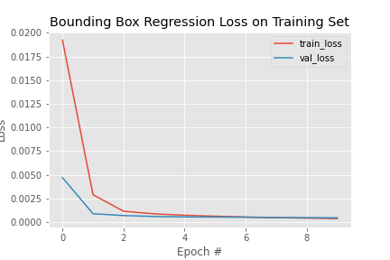
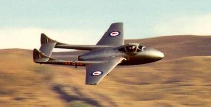
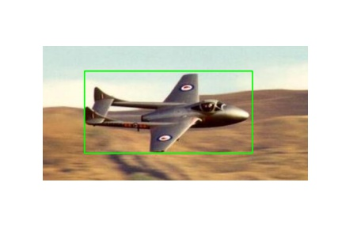

# Object Detection

This repository contains a simple project for the implementation of an object detection system, using bounding boxes. The project was implemented using **Python** programming language and specifically the **Keras** framework.


### Dataset

To run this code, dataset **Caltech 101** should be downloaded. The next step is the extraction of the contains of *airplanes* folder inside the path *dataset/images* and the contains of *Airplanes_Side_2* inside the path *dataset/annotations*. The structure of the project has to be as following:

```
dataset/
dataset/images
dataset/annotations
output/
test/
bounding_box.py
```


### Execution

To compile and run the source code, you must have Python downloaded and execute:

``` bash
python bounding_box.py
```


### Code Explanation

The code makes use of Tensorflow and Keras libraries in order to train a Regression Model to predict 4 values. These 4 values correspond to the corners of a bounding box, which indicates the object inside our input image. The implementation of the model was based on **Transfer Learning**, by loading **VGG-16** without the head FC layer and then freezing all of its layers, so they will not be updated during training process. This network was then connected to a series of Dense layers that end to an output layer with 4 neurons, each one corresponds to a point of the predicted bounding box. 

The optimizer used was Adam, while the loss function was **MSE**, which is regularly used to Regression problems. After 10 epochs, the performance of the model was already converged, as we can see in the graph below:

<p allign = 'center'>
    
</p>


### Testing

To test the performance of our model we can see the predicted bounding boxes to some random images, sampled for test. An example can be seen below:
<p allign = 'center'>
     
</p>
